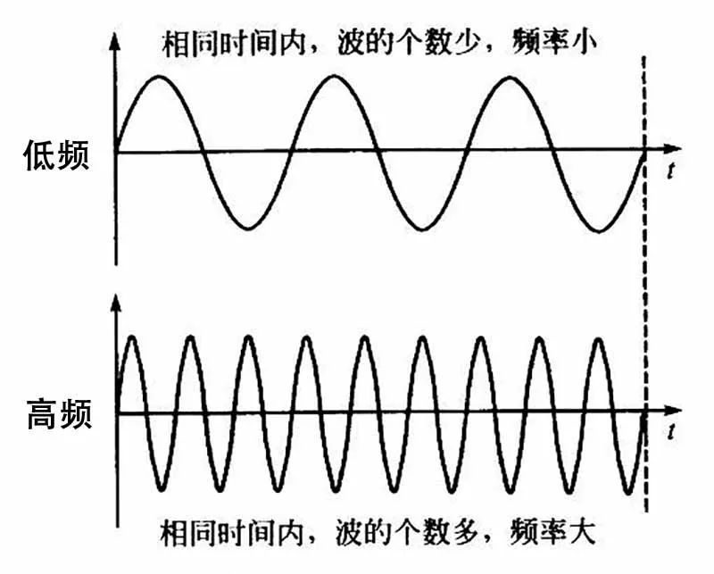

---
tags:
  - "#做中学"
---
# 软件级别
## 关于将`ClassrommRotation`中音频保存的脑残事

# 知识
--- 
## 关于同一音频的不同频率传播速度的疑惑

此前我一直错误的认为下图中低频与高频信号在t时刻所**经过的距离**是不同的（从图中朴素的看出）

但是！经过一番搜索后发现不同频率的波在绝大多数情况下其传播速度都是一致的，上图从坐标原点到t时刻的波形长度并不代表声波所经过的距离。**因为声波是走直线的！图示仅为了读者能够直观的感受到高低频率的区别**！

至此，其实也就能够明白为什么在固定位置采集到的音频各个频率相位会有差值了。其实是因为越高频其信号的波动越显著！比如你在上图中的`0`~`t`中任意从左到右取若干作为*信号采集位置*，并且对比其相位变化就会发现相位差的奥秘
